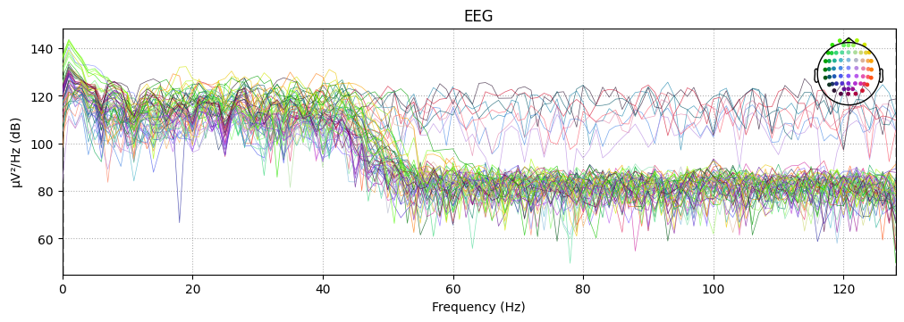
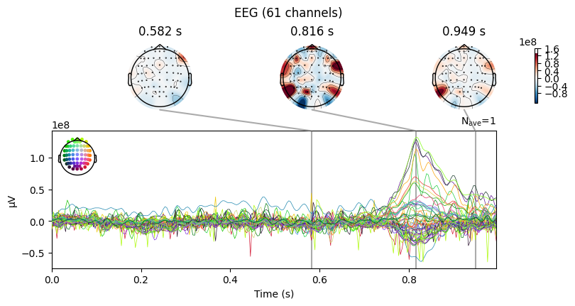
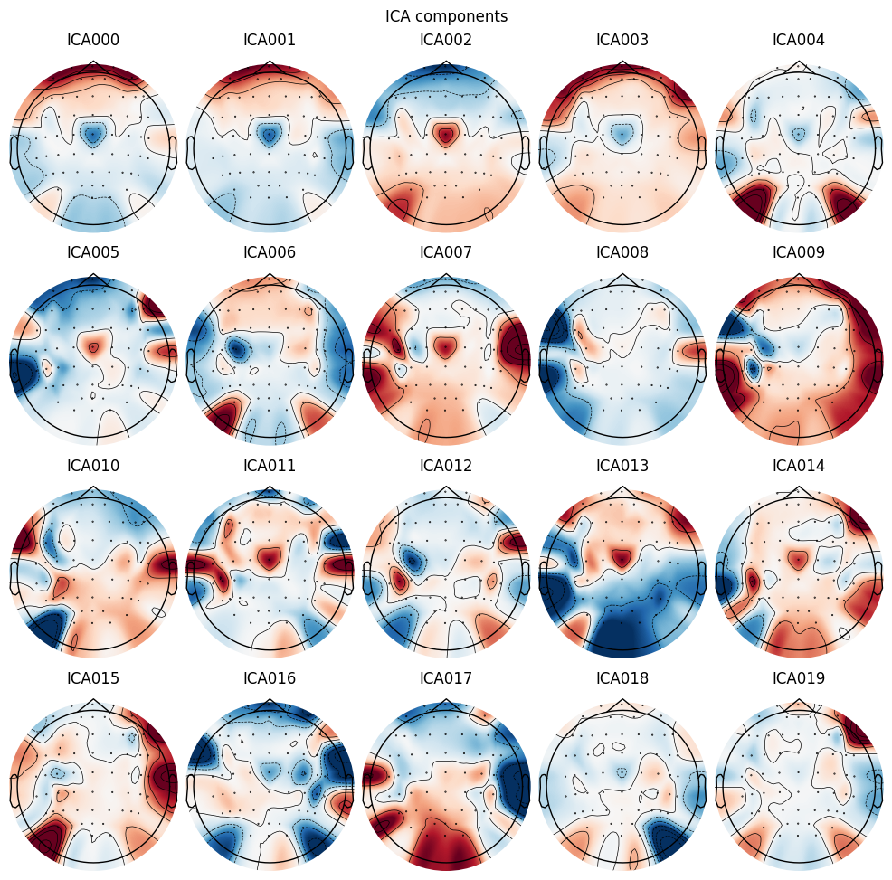
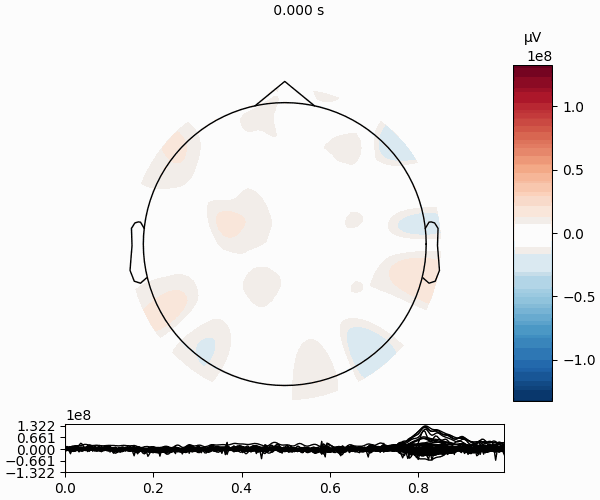

# EEG Alcohol Dataset Analysis

This repository contains an analysis of the EEG alcohol dataset. The analysis aims to identify patterns and insights related to alcohol consumption through EEG data.

## Table of Contents

- [Dataset Description](#dataset-description)
- [Attribute Information](#attribute-information)
- [Analysis](#analysis)
- [Visualization](#visualization)

## Dataset Description

This data arises from a large study to examine EEG correlates of genetic predisposition to alcoholism. It contains measurements from 64 electrodes placed on subject's scalps which were sampled at 256 Hz (3.9-msec epoch) for 1 second.

There were two groups of subjects: alcoholic and control. Each subject was exposed to either a single stimulus (S1) or to two stimuli (S1 and S2) which were pictures of objects chosen from the 1980 Snodgrass and Vanderwart picture set. When two stimuli were shown, they were presented in either a matched condition where S1 was identical to S2 or in a non-matched condition where S1 differed from S2.

- **Source**: [EEG Alcohol Dataset](https://archive.ics.uci.edu/ml/datasets/eeg+database)
- **Attributes**: 
  - Subject ID
  - Channel data
  - Alcohol consumption status
  - Various extracted features

## Attribute Information

Each trial is stored in its own file and will appear in the following format.

trial number sensor position sample num sensor value subject identifier matching condition channel name time

0 FP1 0 -8.921 a S1 obj 0 co2a0000364 0

0 AF8 87 4.14 a S1 obj 33 co2a0000364 0.33

The columns of data are:

the trial number,

sensor position,

sample number (0-255),

sensor value (in micro volts),

subject identifier(Alcoholic(a) or Control (c)),

matching condition(a single object shown (S1 obj), object 2 shown in a matching condition (S2 match), and object 2 shown in non matching condition (S2 nomatch)),

channel number(0-63),

name(a serial code assigned to each subject),

time(inverse of sample num measured in seconds))

## Analysis

The analysis includes preprocessing of the EEG data, feature extraction, and various machine learning models to classify alcohol consumption status. The steps are as follows:
1. Data Cleaning
2. Feature Engineering
3. Model Training
4. Evaluation

## Visualization

The `assets` folder contains visualizations of the EEG data and results of the analysis. Below are some of the visualizations:

### EEG Signal Plots

### EEG signals over time

### ICA 

### Animated Visualization

